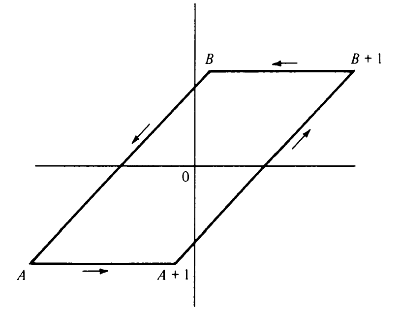
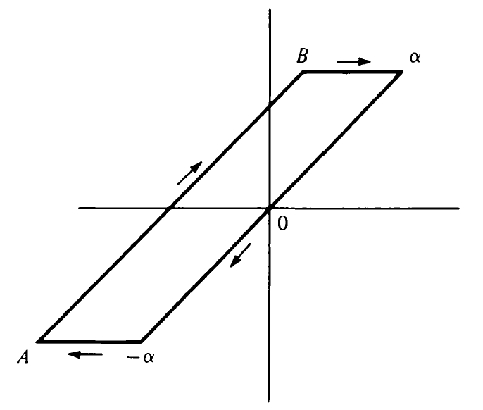

# 9. Quadratic Residues and the Quadratic Reciprocity Law

## 9.1 Quadratic residues

As shown in Chapter 5, the problem of solving a polynomial congruence

$$
f(x) \equiv 0 \pmod{n}
$$

can be reduced to polynomial congruences with prime moduli plus a set of
linear congruences. This chapter is concerned with quadratic congruences
of the form

$$
x^2 \equiv n \pmod{p} \qquad(1)
$$

where $p$ is an odd prime and $n \equiv 0 \pmod{p}$. Since the modulus is prime we know that (1) has at most two 
solutions. Moreover, if $x$ is a solution so is $-x$, hence the number of solutions is either $0$ or $2$.

**Definition** If congruence (1) has a solution we say that $n$ is a quadratic residue mod $p$ and we write $nRp$. 
If (1) has no solution we say that $n$ is a quadratic nonresidue mod $p$ and we write $n\bar{R}p$.

Two basic problems dominate the theory of quadratic residues:

1. Given a prime $p$, determine which $n$ are quadratic residues mod $p$ and which are quadratic nonresidues mod $p$.
2. Given $n$, determine those primes $p$ for which $n$ is a quadratic residue mod $p$ and those for which $n$ is a 
   quadratic nonresidue mod $p$.

We begin with some methods for solving problem 1.

EXAMPLE To find the quadratic residues modulo $11$ we square the numbers $1, 2, \ldots , 10$ and reduce mod $11$. We 
obtain 

$$
1^2 \equiv 1, 2^2 \equiv 4, 3^2 \equiv 9, 4^2 \equiv 5, 5^2 \equiv 3 \pmod{11}
$$

It suffices to square only the first half of the numbers since

$$
6^2 \equiv (-5)^2 \equiv 3, 7^2 \equiv (-4)^2 \equiv 5, \ldots, 10^2 \equiv (-1)^2 \equiv 1 \pmod{11}
$$

Consequently, the quadratic residues mod $11$ are $1, 3, 4, 5, 9$, and the nonresidues are $2, 6, 7, 8, 10$.

This example illustrates the following theorem.

**Theorem 9.1** Let $p$ be an odd prime. Then every reduced residue system mod $p$ contains exactly $(p-1)/2$ quadratic 
residues and exactly $(p-1)/2$ quadratic nonresidues mod $p$. The quadratic residues belong to the residue classes 
containing the numbers

$$
1^2, 2^2, 3^2, \ldots, \left(\frac{p-1}{2}\right)^2 \qquad (2)
$$

PROOF. First we note that the numbers in (2) are distinct mod $p$. In fact, if $x^2 \equiv y^2 \pmod{p}$ with 
$1 \le x \le (p-1)/2$ and $1 \le y \le (p-1)/2$, then

$$
(x-y)(x+y) \equiv 0 \pmod{p}
$$

But $1 \lt x+y \lt p$ so $x-y \equiv 0 \pmod{p}$, hence $x=y$. Since 

$$
(p-k)^2 \equiv k^2 \pmod{p}
$$

every quadratic residue is congruent mod $p$ to exactly one of the numbers in (2). This completes the proof. $\square$

The following brief table of quadratic residues $R$ and nonresidues $\bar{R}$ was obtained with the help of Theorem 9.1. 

|           | $p=3$ | $p=5$ | $p=7$   | $p=11$       | $p=13$          |
| :-------- | :---- | :---- | :------ | :----------- | :-------------- |
| $R$       | $1$   | $1,4$ | $1,2,4$ | $1,3,4,5,9$  | $1,3,4,9,10,12$ |
| $\bar{R}$ | $2$   | $2,3$ | $3,5,6$ | $2,6,7,8,10$ | $2,5,6,7,8,11$  |

## 9.2 Legendre's symbol and its properties

**Definition** Let $p$ be an odd prime. If $n \not\equiv 0 \pmod{p}$ we define Legendre's symbol $(n|p)$ as follows:

$$
(n|p) = \begin{cases}
        +1 \text{ if } nRp \\
        -1 \text{ if } n\bar{R}p
        \end{cases}
$$

If $n \equiv 0 \pmod{p}$ we define $(n|p)=0$.

EXAMPLES. $(1|p)=1$, $(m^2|p)=1$, $(7|11)=-1$, $(22|11)=0$.

*Note.* Some authors write $\left(\frac{n}{p}\right)$ instead of $(n|p)$.

It is clear that $(m|p)=(n|p)$ whenever $m \equiv n \pmod{p}$, so $(n|p)$ is a periodic function of $n$ with period $p$.

The little Fermat theorem tells us that $n^{p-1} \equiv 1 \pmod{p}$ if $p \nmid n$. Since

$$
n^{p-1}-1 = (n^{(p-1)/2} - 1)(n^{(p-1)/2} + 1)
$$

it follows that $n^{(p-1)/2} \equiv \pm{1} \pmod{p}$. The next theorem tells us that we get $+1$ if $nRp$ and $-1$ if 
$n\bar{R}p$.

**Theorem 9.2** Euler's criterion. Let $p$ be an odd prime. Then for all $n$ we have

$$
(n|p) \equiv n^{(p-1)/2} \pmod{p}
$$

PROOF. If $n \equiv 0 \pmod{p}$ the result it trivial since both members are congruent to $0$ mod $p$. Now suppose 
$(n|p)=1$. Then there is an $x$  such that $x^2 \equiv n \pmod{p}$ and hence

$$
n^{(p-1)/2} \equiv (x^2)^{(p-1)/2} = x^{p-1} \equiv 1 = (n|p) \pmod{p}
$$

This proves the theorem if $(n|p)=1$.

Now suppose that $(n|p)=-1$ and consider the polynomial 

$$
f(x) = x^{(p-1)/2} - 1
$$

Since $f(x)$ has degree $(p-1)/2$ the congruence 

$$
f(x) \equiv 0 \pmod{p}
$$

has at most $(p-1)/2$ solutions. But the $(p-1)/2$ quadratic residues mod $p$ are solutions so the nonresidues are not. 
Hence

$$
n^{(p-1)/2} \not\equiv 1 \pmod{p} \text{ if } (n|p)=-1
$$

But $n^{(p-1)/2} \equiv \pm 1 \pmod{p}$ so $n^{(p-1)/2} \equiv -1 \equiv (n|p) \pmod{p}$. This completes the proof. 
$\square$

**Theorem 9.3** Legendre's symbol $(n|p)$ is a completely multiplicative function of $n$.

PROOF. If $p|m$ or $p|n$ then $p|mn$ so $(mn|p)=0$ and either $(m|p)=0$ or $(n|p)=0$. Therefore $(mn|p)=(m|p)(n|p)$ if 
$p|m$ or $p|n$.

If $p \nmid m$ and $p \nmid n$ then $p \nmid mn$ and we have

$$
(mn|p) \equiv (mn)^{(p-1)/2} = m^{(p-1)/2} n^{(p-1)/2} \equiv (m|p)(n|p) \pmod{p}
$$

But each of $(mn|p)$, $(m|p)$ and $(n|p)$ is $1$ or $-1$ so the difference 

$$
(mn|p) - (m|p)(n|p)
$$

is either $0$, $2$ or $-2$. Since this difference is divisible by $p$ it must be $0$.

*Note.* Since $(n|p)$ is a completely multiplicative function of $n$ which is periodic with period $p$ and vanishes 
when $p|n$, it follows that $(n|p)=\chi(n)$, where $\chi$ is one of the Dirichlet characters modulo $p$. The Legendre 
symbol is called the *quadratic character* mod $p$. 

## 9.3 Evaluation of $(-1|p)$ and $(2|p)$

## 9.4 Gauss' lemma

## 9.5 The quadratic reciprocity law

## 9.9 Gauss sums and the quadratic reciprocity law

## 9.10 The reciprocity law for quadratic Gauss sums

## 9.11 Another proof of the quadratic reciprocity law
